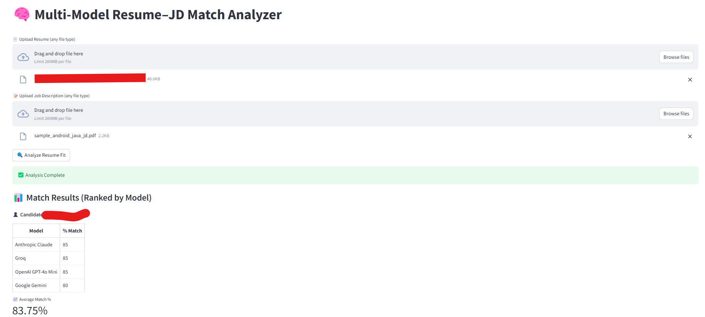

# 🧠 Resume-Job Match Application (LLM-Powered)



This is a **Streamlit-based web app** that evaluates how well a resume matches a job description using powerful Large Language Models (LLMs) such as:

- OpenAI GPT
- Anthropic Claude
- Google Gemini (Generative AI)
- Groq LLM
- DeepSeek LLM

The app takes a resume and job description as input files, sends them to these LLMs, and returns:

- ✅ Match percentage from each model
- 📊 A ranked table sorted by match %
- 📈 Average match percentage
- 🧠 Simple, responsive UI for instant feedback

## 📂 Features

- Upload **any file type** for resume and job description (PDF, DOCX, TXT, etc.)
- Automatic extraction and cleaning of text
- Match results across multiple models in real time
- Table view with clean formatting
- Uses `.env` file for secure API key management

## 🔐 Environment Setup (`.env`)

Create a `.env` file in the project root and add the following API keys:

```env
OPENAI_API_KEY=your-openai-api-key
ANTHROPIC_API_KEY=your-anthropic-api-key
GOOGLE_API_KEY=your-google-api-key
GROQ_API_KEY=your-groq-api-key
DEEPSEEK_API_KEY=your-deepseek-api-key 
```

## ▶️ Running the App
### Launch the app using Streamlit:

streamlit run resume_agent.py

### The app will open in your browser at:
📍 http://localhost:8501


