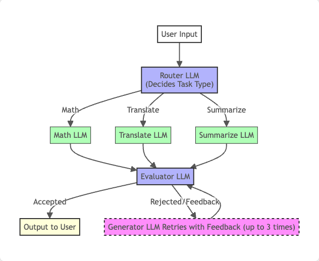

# LLM Router & Evaluator-Optimizer Workflow

This project demonstrates a simple, modular workflow for orchestrating multiple LLM tasks using OpenAI's API, with a focus on clarity and extensibility for beginners.

## Workflow Overview


1. **User Input**: The user provides a request (e.g., a math problem, translation, or text to summarize).
2. **Router LLM**: A general-purpose LLM analyzes the input and decides which specialized LLM (math, translation, or summarization) should handle it.
3. **Specialized LLMs**: Each task (math, translation, summarization) is handled by a dedicated prompt to the LLM.
4. **Evaluator-Optimizer Loop**:
    - The solution from the specialized LLM is evaluated by an evaluator LLM.
    - If the evaluator deems the solution incorrect or unhelpful, it provides feedback.
    - The generator LLM retries with the feedback, up to 3 attempts.
    - If accepted, the result is returned to the user.

## Key Components

- **Router**: Determines the type of task (Math, Translate, Summarize) using a single-word response from the LLM.
- **Specialized LLMs**: Prompts tailored for each task, leveraging OpenAI's chat models.
- **Evaluator-Optimizer**: Uses a Pydantic schema and OpenAI's structured output to validate and refine the solution, ensuring quality and correctness.

## Technologies Used
- Python 3.8+
- [OpenAI Python SDK (v1.91.0+)](https://github.com/openai/openai-python)
- [Pydantic](https://docs.pydantic.dev/)

## Setup

1. **Install dependencies**:
   ```bash
   pip install openai pydantic
   ```
2. **Set your OpenAI API key**:
   ```bash
   export OPENAI_API_KEY=sk-...
   ```
3. **Run the script**:
   ```bash
   python main.py
   ```

## Example Usage

- **Math**: `calculate 9+2`
- **Translate**: `Translate 'Hello, how are you?' to French.`
- **Summarize**: `Summarize: The cat sat on the mat. It was sunny.`

The router will direct your request to the appropriate LLM, and the evaluator will ensure the answer is correct or provide feedback for improvement.

## Notes
- The workflow is designed for learning and can be extended with more tasks or more advanced routing/evaluation logic.
- The evaluator uses OpenAI's structured output (with Pydantic) for robust, type-safe validation.

---

Feel free to experiment and expand this workflow for your own LLM projects!


