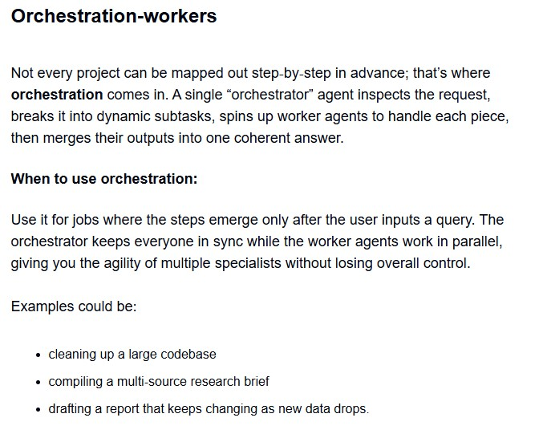
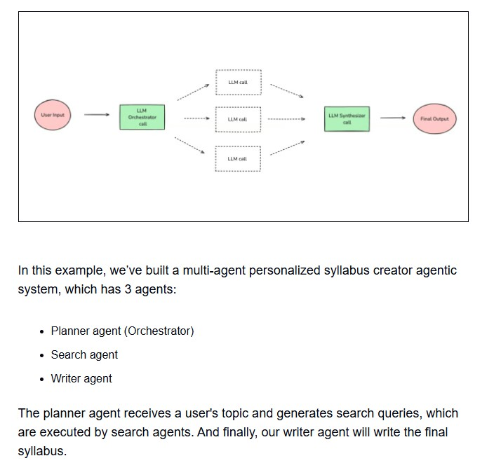

<hr>


### How to Get the Google Search API Keys (Step-by-Step)
#### Your script requires two credentials:
```
    - GOOGLE_SEARCH_API_KEY: This authenticates your requests with your Google Cloud project.
    - GOOGLE_SEARCH_CONTEXT (also known as a Programmable Search Engine ID): 
        - This tells Google what to search over (e.g., the entire web, a specific set of sites, etc.).
```

#### Here is a step-by-step guide to get both:
<hr>

### Part 1: Create a Google Cloud Project and API Key

1. Go to the Google Cloud Console: Navigate to the Google Cloud Console. If you don't have an account, you will need to create one.
2. Create a New Project:
    - Click on the project selector dropdown at the top of the page and select "New Project".
    - Give your project a name (e.g., "My Search App") and click "Create".

3. Enable the Custom Search API:
    - Once your project is created, make sure it is selected in the project dropdown.
    - In the search bar at the top, search for "Custom Search API" and select it from the results.
    - Click the "Enable" button. You may have to wait a minute for this to complete.

4. Create API Credentials:

 - After the API is enabled, you will be taken to its dashboard. Click on the "Credentials" tab on the left-hand menu.
 - Click on "+ Create Credentials" at the top of the page and select "API key".
- A new API key will be generated and displayed in a pop-up window. Click the copy icon to copy it. This is your GOOGLE_SEARCH_API_KEY.


    Important: For security, it's recommended to restrict your API key. Click "Edit API key" and under "API restrictions," select "Restrict key" and choose the "Custom Search API" to ensure it can only be used for this service.

<hr>

### Part 2: Create a Programmable Search Engine and Get the Context ID

1. Go to the Programmable Search Engine Control Panel:  Navigate to the `Programmable Search Engine control panel`.
2. Create a New Search Engine:
    - Click the "Add" button.
    - In the "What to search?" section, you can specify particular sites (e.g., stackoverflow.com, wikipedia.org) or, if you want to search the entire web, toggle the "Search the entire web" option to ON.
    - Give your search engine a name and click "Create".
3. Get the Search Engine ID (Context):
    - After creating the search engine, you will be on its setup page.
    - Under the "Basics" tab, you will find the "Search engine ID". Click the copy button to copy this value. This is your GOOGLE_SEARCH_CONTEXT.

<hr>

### Part 3: Configure Your Script

Now that you have your two keys, you need to make them available to your Python script. You are using the dotenv library, which is an excellent practice.
1. Create a .env file: In the same directory as your Python script, create a file named `.env`.
2. Add your keys to the file: Add the keys you just copied into the .env file like this:
```
GOOGLE_SEARCH_API_KEY="YOUR_API_KEY_HERE"
GOOGLE_SEARCH_CONTEXT="YOUR_SEARCH_ENGINE_ID_HERE"
```